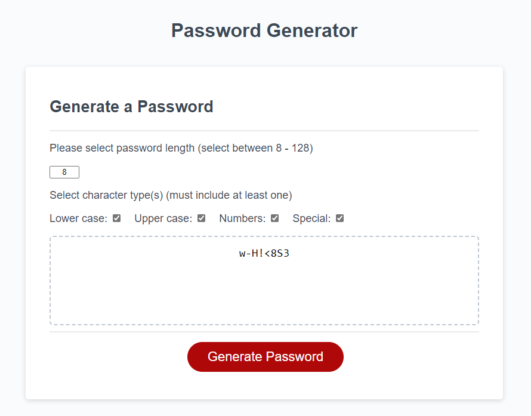

# Password-Generator-CYM
 

## Description

This refactored code to have a working random generator.

## Usage

This takes a text input to determine password length and four checkboxes to determine the type of characters used. The types of characters ar lower case letters, uppercase letters, numbers, and special characters such as ! and $.

## Credits

Author: Xandromus from the Rice Coding Bootcamp

Feb 13, 2020

Source code: HTML,  CSS, and JavaScript

https://github.com/coding-boot-camp/friendly-parakeet

## Features

To guarantee the generated code includes selected character types, the code randomly chooses four indexes to potentially replace the current character. In the console the user can check what postion the guaranteed character would be.

## Link/Screentshot

https://cymcolor.github.io/Password-Generator-CYM/

